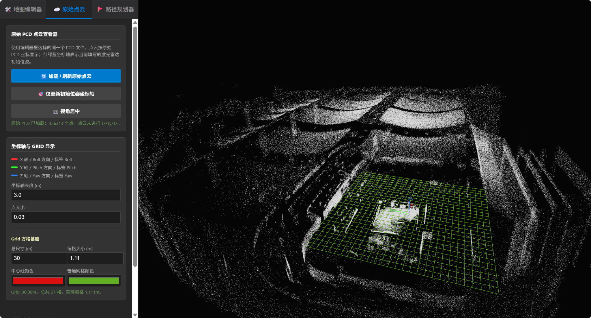
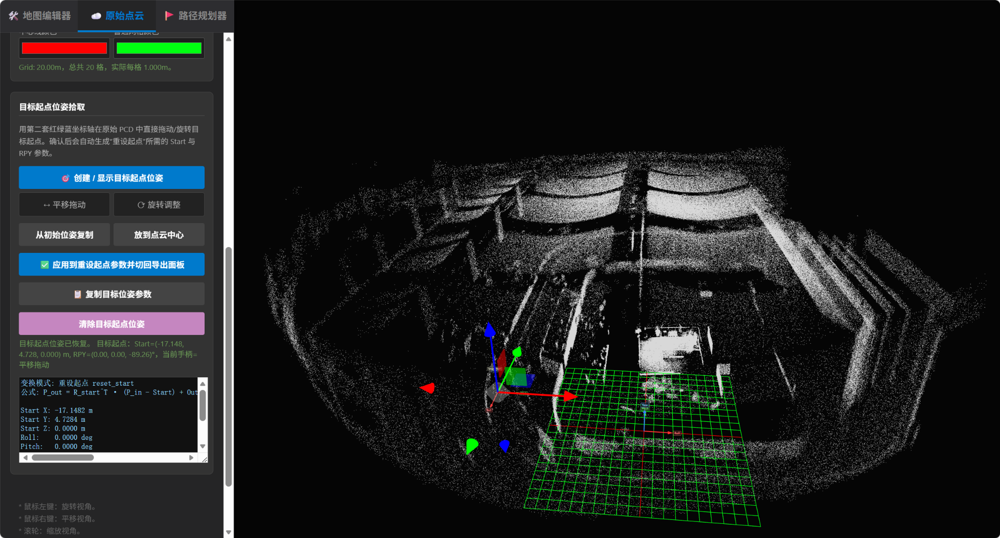
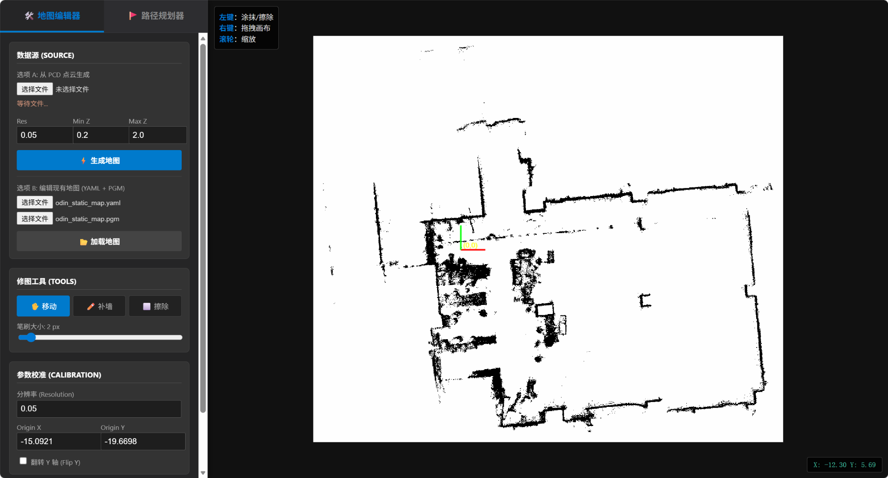
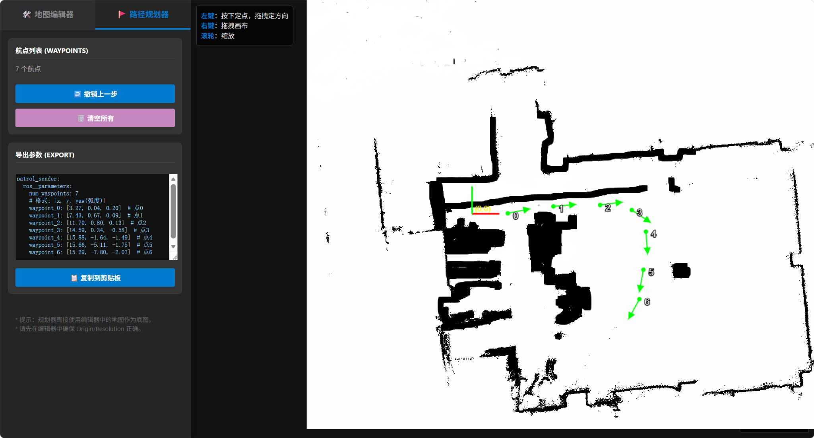

# ROS 2 Nav Studio：PCD 地图编辑器与路径规划工具

一个轻量级、浏览器端运行的 ROS 2 地图预处理工具，用于原始 PCD 点云查看、地图原点重设、二维占据栅格地图编辑以及航点路径规划。



---

## 功能特性

### 原始 PCD 点云查看器

- 原生 `.pcd` 点云可视化
- 三维自由视角查看
- 点大小调节
- Grid 网格尺寸与颜色调节
- Roll / Pitch / Yaw 坐标轴标签
- 激光雷达位姿显示



---

### 目标起点位姿拾取

直接在原始点云中交互式放置新的重定位起点。

支持：

- 平移拖动
- 旋转调整
- 自动生成 Start XYZ 与 RPY 参数
- 一键同步到 PCD 导出参数
- 浏览器本地保存参数

重设起点公式：

```text
P_out = R_start^T · (P_in - Start) + Out
```

适用于：

- LiDAR 重定位
- 地图原点重设
- 多次建图坐标统一
- SLAM 地图坐标系转换

---

### PCD 刚体变换导出

支持的 PCD 数据模式：

- `DATA ascii`
- `DATA binary`

支持两种变换模式：

- 重设起点
- 直接刚体变换

功能包括：

- 旋转
- 平移
- 坐标系重设
- VIEWPOINT 重写

---

### 占据栅格地图编辑器

支持生成与编辑 ROS 地图。

功能包括：

- 从 PCD 生成地图
- 加载已有 `PGM + YAML`
- 补墙
- 擦除障碍物
- 修改 Resolution 与 Origin
- 导出 ROS 地图



---

### 路径规划器

用于创建带方向角的巡逻航点。

支持：

- 鼠标点击放置航点
- 拖动设置朝向
- 自动计算 yaw
- ROS 参数导出



---

## 快速开始

克隆仓库：

```bash
git clone <your-repo>
```

直接使用浏览器打开：

```text
ros2_nav_studio_pcd_transform_export_target_pose_picker.html
```

或者启动本地 HTTP 服务：

```bash
python3 -m http.server 8000
```

浏览器访问：

```text
http://localhost:8000
```

---

## 推荐使用流程

### PCD 点云重设起点

1. 打开网页工具。
2. 在“地图编辑器”中选择 `.pcd` 文件。
3. 切换到“原始点云”页面。
4. 加载或刷新原始点云。
5. 创建或显示目标起点位姿。
6. 在三维视图中平移、旋转目标位姿。
7. 将目标位姿应用到重设起点导出面板。
8. 导出变换后的 PCD 文件。

### 从 PCD 生成二维地图

1. 选择 `.pcd` 文件。
2. 设置地图分辨率。
3. 设置 `Min Z` 和 `Max Z` 高度过滤范围。
4. 根据需要调整 LiDAR 位姿参数。
5. 生成地图。
6. 根据需要编辑地图。
7. 导出 `PGM + YAML`。

### 编辑已有地图

1. 选择 `.yaml` 文件。
2. 选择对应的 `.pgm`、`.png` 或 `.jpg` 地图图片。
3. 加载地图。
4. 使用补墙 / 擦除工具编辑障碍物。
5. 检查 Resolution 与 Origin。
6. 导出更新后的地图。

### 创建航点路径

1. 切换到路径规划器。
2. 鼠标点击放置航点。
3. 拖动设置航点朝向。
4. 重复添加多个航点。
5. 复制导出的 ROS 参数文本。

---

## 支持格式

### 输入

- `.pcd`
- `.yaml`
- `.pgm`
- `.png`
- `.jpg`

### 输出

- 变换后的 `.pcd`
- ROS 占据栅格地图 `.pgm`
- ROS 地图描述 `.yaml`
- 航点参数文本

---

## 坐标约定

工具使用常见 ROS Roll / Pitch / Yaw 顺序：

```text
R = Rz(yaw) * Ry(pitch) * Rx(roll)
```

三维查看器中的坐标轴颜色：

- 红色：X 轴 / Roll 方向
- 绿色：Y 轴 / Pitch 方向
- 蓝色：Z 轴 / Yaw 方向

---

## PCD 支持情况

当前支持：

- `DATA ascii`
- `DATA binary`

暂不支持：

- `DATA binary_compressed`

如果你的 PCD 文件是 `binary_compressed` 格式，需要先转换为 ASCII 或 Binary PCD。

---

## 建议项目结构

```text
.
├── README.md
├── README_zh.md
├── ros2_nav_studio_pcd_transform_export_target_pose_picker.html
└── docs
    └── images
        ├── 38e1dfe8902e0b316a81d5bc3418283d.png
        ├── 4a815926f54a2ffbac1e765ade02178e.png
        ├── b7a8ebb9c22ecb715be3b7ffcde608ae.png
        └── c9844c818346847ff4e86d2f63329cba.png
```

本 README 中的图片路径已经按照你当前仓库 `docs/images` 目录里的文件名写好。

---

## 技术栈

- Three.js
- PCDLoader
- OrbitControls
- HTML5 Canvas
- 原生 JavaScript

---

## 注意事项

- 工具完全在浏览器中运行。
- 文件由浏览器本地处理，不需要上传到服务器。
- 大型 PCD 文件可能占用较多内存。
- 渲染性能取决于浏览器和显卡性能。
- 路径规划器只负责航点姿态编辑，不是全局路径搜索算法。

---

## License

MIT License
